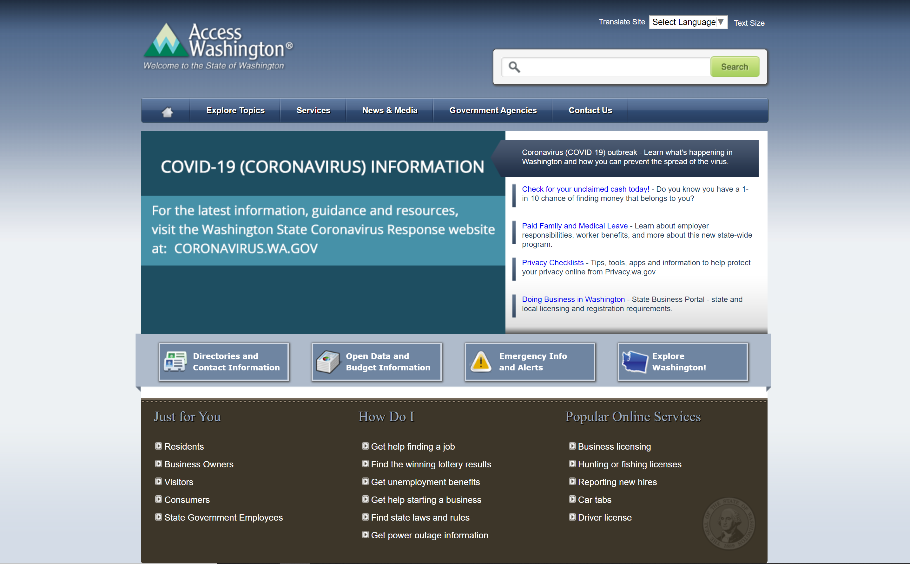

# Heuristic Analysis of Washington State's Government Websites 

## Matthew Tran, DH110 F21 

### assignment01: Heuristic Evaluation 

---

This assignment details a heuristic analysis of websites for Washington state's government for Education and Transportation. 
Namely, Nielson's 10 heuristics will be used in evaluating these sites. 

---

1. Washington State Board of Education 

https://www.sbe.wa.gov/

