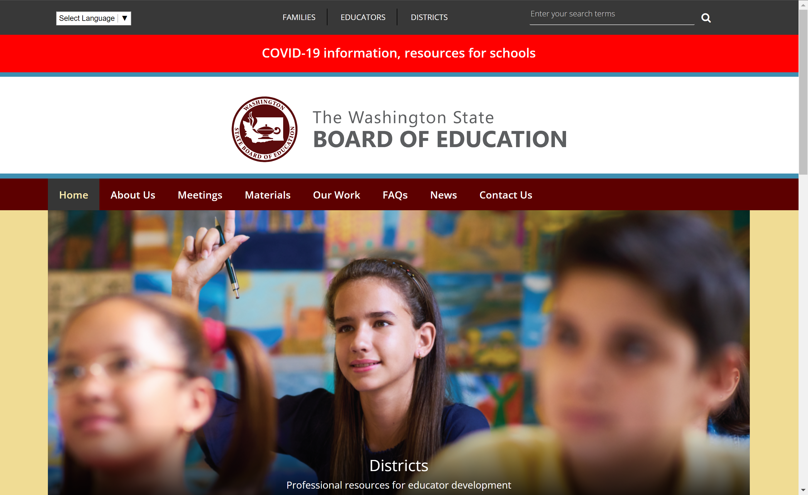
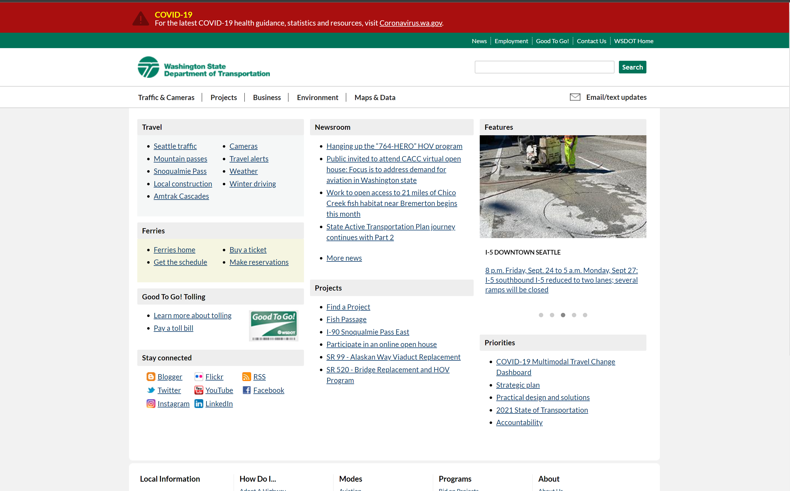

# Heuristic Analysis of Washington State's Government Websites 

## Matthew Tran, DH110 F21 

### assignment01: Heuristic Evaluation 

---

This assignment details a heuristic analysis of websites for Washington state's government for Education and Transportation. 
Namely, Nielson's 10 heuristics will be used in evaluating these sites. 

---

# 1. Washington State Board of Education 

https://www.sbe.wa.gov/

 
### This website is Washington State's website for the Board of Education. Primarily, this site is a resource for families, teachers, educators, and public schools in the state. 

### The site is well designed and provides an enjoyable user experience. Navigation of the site is easy, and finding target information can be done efficiently. No errors occurred during navigation. There are few critiques of this website. 

## Heuristic Analysis:

### 1. Visibility of System Status: 0
The user is able to tell if the system is functioning properly. 
When the site launches properly, there are large rotating images signal to the user that the website is live and functioning properly. I think this is an effective way to signal that the site is running properly without using an explicit message. 

### 2. Match Between System and Real World: 0
The system, though in a digital environment, behaves in ways that are similar to the real world.
The active tab on the site is highlighted (in this case darkened) which signals to the user where they are on the site. When cursing over tabs, the additional information drops down, as opposed to up or to the side, for example. 

### 3. User Control and Freedom: 0
The user is not restricted in navigating and using the system. 
The user has the ability to control the site, such as changing the language. This feature is presented at the top of the site. Navigation back and forth between pages is easy.

### 4. Consistency and Standards: 0
Common traits of the site do not contradict each other in design. 
The site is designed with a consisteny layout, color story, and typography. To the eye, the site is cohesive and there are no inconsistencies that are jarring to the user. 

### 5. Recognition Rather than Recall: 1
Navigation of the system does not require active effort on the part of the user, because the design aids in their use of the system. 
The site makes use of icons that for the most part are standard in their meaning or very clear. For example, the Twitter logo is used when mentioned, and graduation requirements being represented by a person in a cap and gown. Some icons are not as clear in their meaning, for example, "school improvement framework" being represented as bar graphs. 

### 6. Error Prevention: 0
The system is designed in a way that prevents any interruptions to the user's experience. 
While navigating the site, I did not experience any interruptions to my browsing, so I think the site properly meets this heuristic. 

### 7. Flexibility and Efficient Use: 0
The user can achieve the goals of the system quickly and without much effort. 
Many of the topics about which I tried to find information could be found with only a few gestures of interaction with the site. This tells me the the information and pages were organized in a way that makes the site very efficient. Complex topics and information can make use of the search bar which is conveniently located at the top of the site. 

### 8. Aesthetic and Minimalist Design: 0
The system is not designed in a way that overwhelms the user or is distracting. 
The site is consistent in the color palette, typography, and layout. Colors are mainly in the red family with some accents. There is only one source of images on the site, with the rest being simple icons. The layout contributes to an organized and uncluttered site. 

### 9. Help Users with Errors: 0
The system will provide the user with assistance and ways to resolve any errors that may occur. 
There were no errors that occurred with navigating the site, and I could not think of any ways to have an error present itself for testing, so this heuristic is left unevaluated. 

### 10. Help and Documentation: 0
The user is able to access information about the system itself. 
The website has an FAQ page that allows the user to answer any questions they may have. 

--- 

# 2. Washington State Department of Transportation 

https://wsdot.wa.gov/

### This website details information relating to various forms of transportation in Washington, such as the metro, ferry, and Amtrak. 

### Besides being aesthetically unappealing, the site lacks some design features that make the site easy to use. Lack of visual aids make the site seem like a mass of text instead of a system of organized information. 

## Heuristic Analysis: 

### 1.  Visibility of System Status: 1 
The user is able to tell if the system is functioning properly. 
Similarly to the Board of Education website, there are rotating images on the site's homepage. I think that this serve as an effective way to tell the user that the site is functioning properly, however, I think the site make the images more central and have them be linked to high interest pages of the site. 

### 2. Match Between System and Real World: 2
The system, though in a digital environment, behaves in ways that are similar to the real world. 
I the presentation of information on the site feel a bit disorganized. One way that this could be addressed is by restructuring the site into a fomat that is similar to how people typically read or consume information, that is top-to-bottom. I think this would help with organizing the information in a way that feel familiar to the user. 

### 3. User Control and Freedom: 0
The user is not restricted in navigating and using the system.  
Almost the entirety of the homepage of the site are links to other pages, so I think this allows the user to navigate to whatever part of the site they are trying to reach. 

### 4. Consistency and Standards: 0
Common traits of the site do not contradict each other in design. 
Formatting of the site is constistent and different parts of the website flow together. 

### 5. Recognition Rather than Recall: 2
Navigation of the system does not require active effort on the part of the user, because the design aids in their use of the system. 
There is a general lack of icons used besides those associated with social media. Because there is an abundance of text on the site, it would help to include some icons to break up the text and make identifying important information easier. As the site is now, the user must read each part of the site to find what they are looking for. 

### 6.  Error Prevention: 0
The system is designed in a way that prevents any interruptions to the user's experience. 
While navigating the site, I did not experience any interruptions to my browsing, so I think the site properly meets this heuristic. 

### 7. Flexibility and Efficient Use: 1
The user can achieve the goals of the system quickly and without much effort. 
By implementing icons, I think that this site could address this heuristic. The site now has an abundance of text, so implementing key icons could make scanning for information more efficient. 

### 8. Aesthetic and Minimalist Design: 1 
The system is not designed in a way that overwhelms the user or is distracting. 
The site very minimal as it is now, but implementing an accent color or some other kinds of graphics to help organize the site and direct the attention of the users would be beneficial. 

### 9. Help Users with Errors: 0
The system will provide the user with assistance and ways to resolve any errors that may occur. 
There were no errors that occurred with navigating the site, and I could not think of any ways to have an error present itself for testing, so this heuristic is left unevaluated. 

### 10. Help and Documentation: 0
The user is able to access information about the system itself. 
The website has an "How do I..." section that allows the user to answer any questions they may have. 

