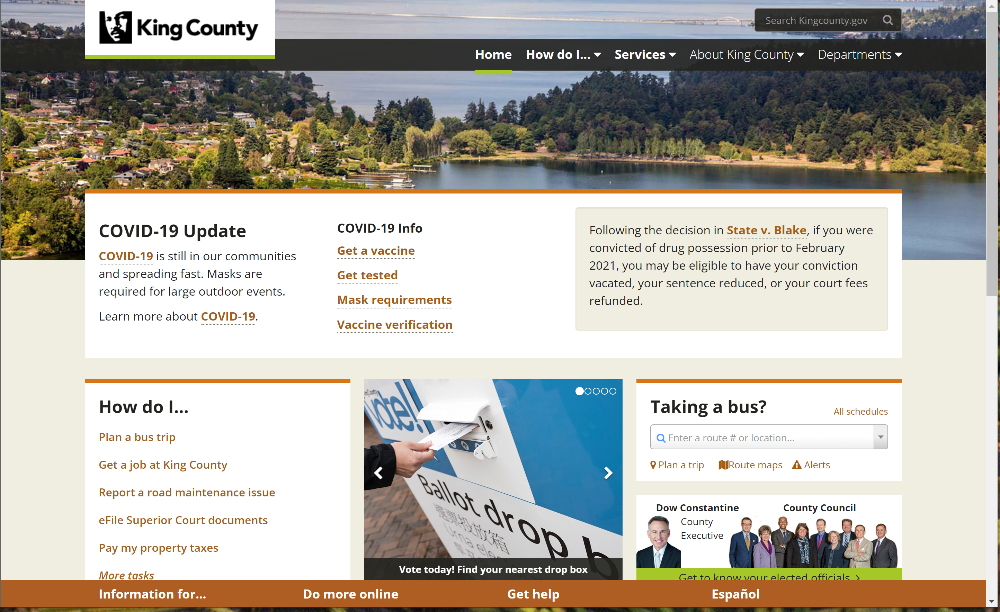
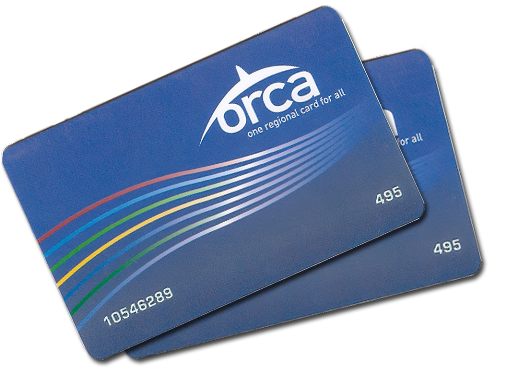

# Assignemnt03: Contextual Inquiry  

## Research Goals and Requirements 

1. The main activity that my projects seeks to support for users is using the [King County governmental website](https://kingcounty.gov/) to investigate how users search for information about public transportation. Specifically, the project will also inverstigate how users transition from physical ticketing to mobile options provided on the site. 

2. The basic need for searching for transportation information is acccess to the website. For using the mobile app, users need to have a smartphone, which can be an Apple or Android product. 

3. Currently, users make use of physical cards or tickets to pay for their fare. 

4. Currently users have a dependence on carrying around their physical Orca cards or keeping track of their tickets. It can be inconvenient for a user to forget their wallet or lose their ticket. Because users always carry around their phones, it would be helpful to consolidate ticketing onto their mobile devices. 

## Target Users 

1. Users who will make use of the mobile options for ticketing are from a young demographic, likely under the age of 35, but mainly concentrated in the college age. Their technological competancy is high, being comfortable using both their own mobile devices and navigating online spaces. The users also take public transportation frequently, at least once per day. This test focuses on a 21 year old college student from Seattle. 

2. Users mainly make use of public transportation for commuting purposes. Trips are typically to and from school, or traveling to destinations recreationally. In many cases, public transportation is used in place of an automobile. 

3. To complete the activity of taking public transportation, users must find their desired route and take one of two actions: a) but a one-time-use ticket for their selected route or b) use their Orca card to pay for the fare. 

## Research Method 

1. For testing, I have decided to conduct an interview in which I will directly interact with the user. I will ask the user to complete a series of tasks on a mobile device. Both the screen as well as the user and myself will be recorded. 

## Details 

1. The interview will take place in-person at the experimenter's apartment. 

2. I will observe the user's navigation of the internet using the Google search engine to find information about public transportation the Transit GO app. I expect that the use will mainly use the King County government website. 
3. Data will be collected by screen-recording the mobile device, a video recording of the interview, and typed notes. 

## The Research 

1. The interview was conducted on October 18th, 2021 at 5:30 p.m. at the experimenter's apartment. The subject was Sophia Rose, a 4th year psychology student at UCLA. She grew up in Seattle and lives there when she is not in LA. 

2. Notes taken from the interview can be found [here.](https://docs.google.com/document/d/15FuBukoJ269Nnp0E_Y_fu3FpI_dpfJMaSa4fQ5yvJk0/edit?usp=sharing)

3. Video of the participant during the interview can be found [here.](https://drive.google.com/file/d/1gsYKVM0pXmEi1FVY0pJQxSYlcc9iLUiP/view?usp=sharing) 

4. Video recording of the participant's screen during testing can be found [here.](https://drive.google.com/file/d/13MR4fiUE4sk1_93TbzmheGj7fFqORLEX/view?usp=sharing) 

5. A transcript of the interview can be found [here.]()  

6. A copy of the script that was used during the interview can be found [here.](https://docs.google.com/document/d/1Tzme49DCZn58Yh-dkl5unq58IvP6xLb0wM4qzqJWkUI/edit?usp=sharing)

## Reflection 

After conducting the interview I gained insight as to how the public transportation system functions in the King County area of Washington, as well as how someone who uses this system of transportation looks for information. I learned that many users of public transportation have to combine information from multiple sites because individually they do not give the user enough information. Namely, Apple maps is used widely when trying to find the specific route to take when planning a path that uses public transportation. However, the application is somewhat limited in few ways. Firstly, the app only gives times that are in the near future, so it is not as helpful when planning a trip in advance. Additionally, the app does not display the cost of the trip very clearly which would be helpful, as many forms of transportation such as the bus require exact change. The other website that users mainly use is the King County website which is something that I expected to see. I think that there is a lot of room for both of these products to be consolidated or improved in a way that will benefit the user. From my subject's responses to the way they search for information in general, I was able to see that their background affects the way that they want to access information, for example their work. 

