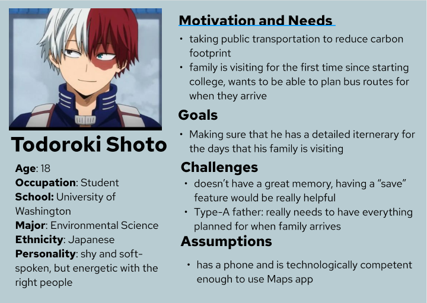
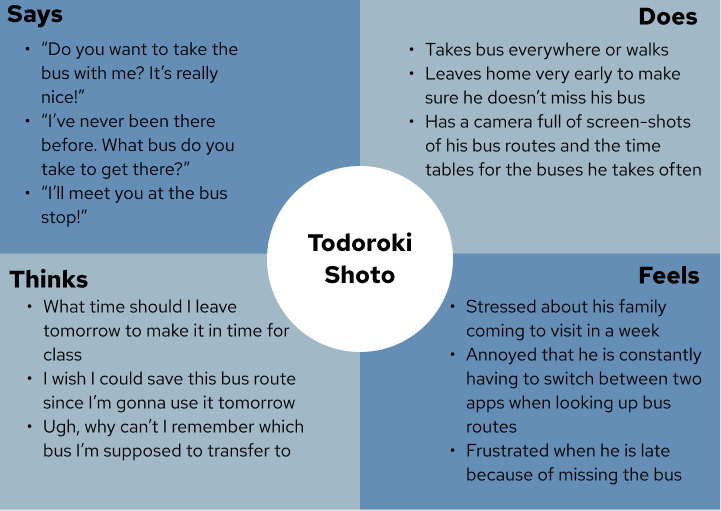
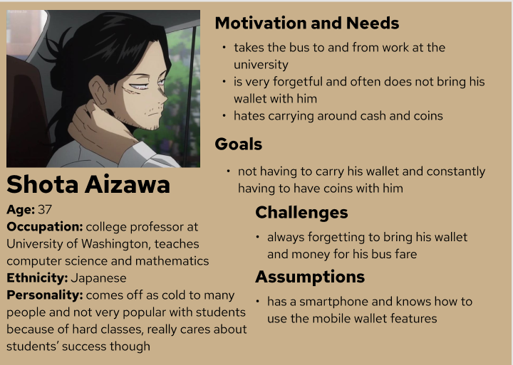
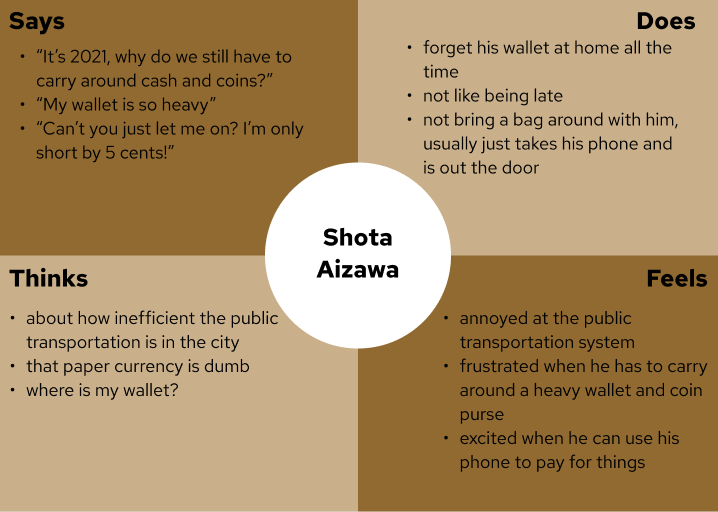
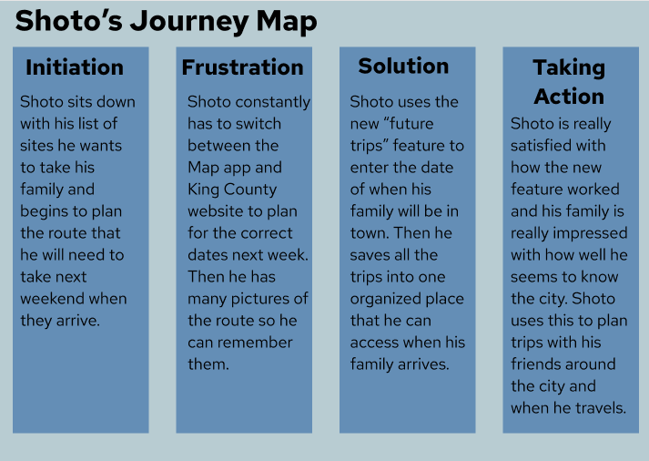
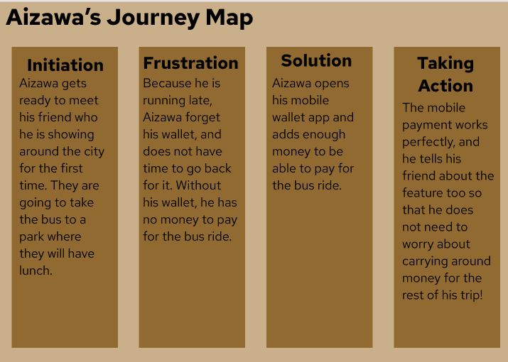

# Assignment05: Personas and Scenarios 

## Digital Storytelling 

Digital storytelling is important because it allows us to focus primarily on the user. By understanding the user and their needs, we are able to create or improve a product in the most effective way. Through the storytelling we can convey our ideas to others and leave behind any biases from our interviews. 

## Proposed Features 

### 1. Future Trips 
As of now, users of the King County public transportation have to rely on two separate applications to plan their trips. Apple Maps and the King County website are used in conjunction, because although the Apple Maps app will plan the route, it does not show times outside of the near future, and so the King County website is referenced for the entire bus schedule. 
A helpful feature for users would be to add a "future trip" planner onto Apple Maps. Within this feature, users can select the date and time that they would like to arrive at their destination. Then, the user can view all teh various paths to take and finally "save" the route for the day of their trip. Consolidating the information from both sources gives the user an easier experience planning their trip, and allowing them to save the route allows them to perform the task in advance which could be very helpful. 

### 2. Mobile Pay 
On certain transportation modes such as the bus, purchasing a ride without a bus card can only be done with exact change. In the modern era where cash is seldom carried, and coins even more so, it can be inconvenient for people to take the bus, especially those who do not use it often. 
To solve this, payment can be integrated into the one item that users always have with them: their phone. By tapping into the mobile wallet function that is already present on most, if not all, smartphones, users can pay for their bus fare with a simple tap of their phone. Because of the digitized form of payment, the previous concern of exact change can be remedied. 

## Personas 

### 1. Todoroki Shoto - environmentally conscious college freshman 

 

 

### 2. Shota Aizawa - stern and impatient professor 

## Scenarios and Journey Maps 

### 1. Shoto's Scenario and Journey Map

Shoto recently moved to Seattle for university. He has only been in the city for a few weeks, so he is not very familiar with the transit system yet, so he has to look up every route whenever he wants to go somewhere. Next weekend is parents' weekend, so his family will be coming from out of town to visit him. He wants to plan a whole weekend of festivities, and wants to make sure that he has the routes all planned out so he can show his family how adjusted he is to the city and so that they can have a good time. 
After making a list of all the places he wants to take his family, Shoto sits down and opens up the maps app on his phone. He enters the date and time of when he wants to go to each destination. After plotting the route, Shoto saves the route, which the app organizes for him as his "upcoming trips." 

### 2. Aizawa's Scenario and Journey Map

As a computer science professor, Aizawa is always thinking of how technology can improve his life. He has come to hate paper currency, because he thinks that it is something that can be easily replaced by digital currency. He is specifically reminded of this every time he takes the bus, and forgets to bring exact change. He curses the bus driver and huffs off the bus. 
After setting up his mobile wallet, Aizawa triumphantly leaves his apartment carrying only his phone. He gets on the bus, and with a simple tap, he has paid his bus fare. He sits down contentedly, thinking about what other things he could pay with using his phone... 

## Reflection 

When I was creating my persona, I tried to think of the kinds of people who would use the product the most. I think the part that I struggled most with was the empathy maps, because that was really where I had to force myself to try and think like the persona that I was creating. In the future, I think that I would want to have more diversity between the personas that I created, for example perhaps making a female persona or someone who is very old. 
