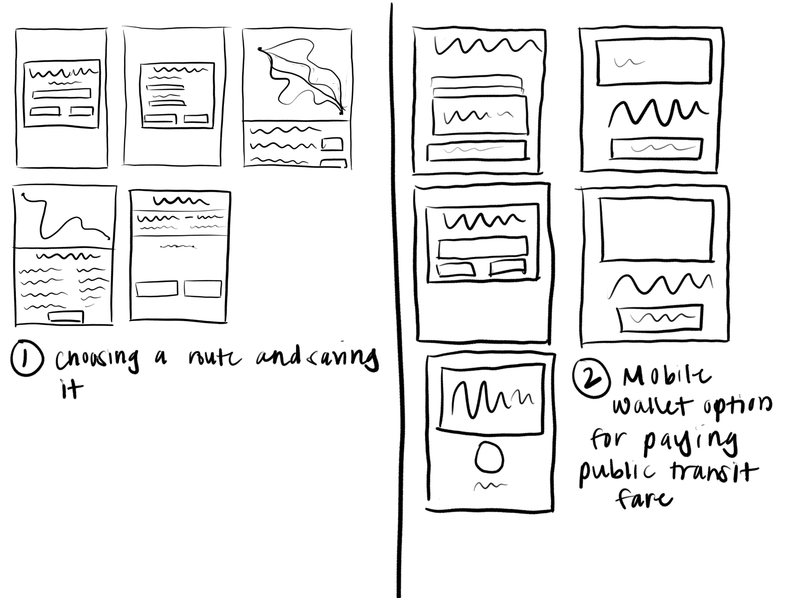

# Assignment05: Low Fidelity Prototype 

## Purpose 

The purpose of low fidelity prototyping is to create a low-cost model of a product to test if a product or feature is usable by the target demographic. 

The target demographic of users for this product are residents of Washington State, speciically those who live in King County. 

## Supported Functions 

1. The first product is a modification to the maps app that allows users to search for their desired route based with the additional parameter of a specified date and time. Users can additionally save their routes for later reference.
2. The second product is a mobile wallet app that users can use to pay for their transit fare via a tap-to-pay feature. Specifically, users can add their Orca card to the wallet and continually add funds to the card for use. 

## Initial Wireframes 

The intial wireframes for the products loosely represent organization of content on each page of the site. It also begins to represent the user's journey of navigating through the application. 

## Product 1: Route Planner 

The target demographic made the complaint that searching for public transit routes for times outside of the immedidate future can be difficult because maps data and the King County website do not provide sufficient information individually. This app seeks to consolodate the two for the convenience of the user. 

The flow for product 1 is relatively simple, in that it follows the users inputting of their route's data, selecting their desired route, and saving it. 

## Product 1 Test 

The user was tasked with planning and saving a route. The user found that the app was intuitive and easy to use. One complaint was that the order of prompts should be that the route should be prompted first, followed by the date and time of the trip, because that is what feel more intuitive as many other trip planners follow this order. 

## Product 2: Mobile Wallet 

The second product was created so that users would not longer have to worry about remembering to bring their cards or exact change only needing their phone to take public transit. 

 

The flow for product 2 follows the user being able to select their cards to pay for their fare, add a new card, or add funds to existing cards. Notably, the cards themselves can be clicked on, not necessarily have explicit buttons. 

## Product 2 Test 

The user was asked to complete two tasks. The first task (in red) was to pay for their transit fare using the mobile wallet. The second task (in green) was to add funds to their cards. Notably, the user did not select the "pay" button when completing the first task. It was explained that the user was confused about the difference between the "pay" and "cards" buttons on the welcome screen, and expressed that the labels could be changed or only one button was needed in their opinion. 

