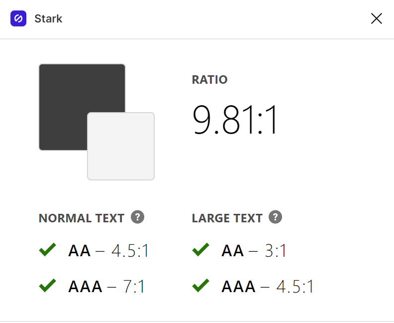
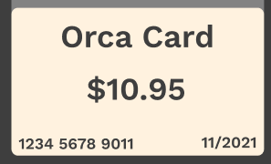
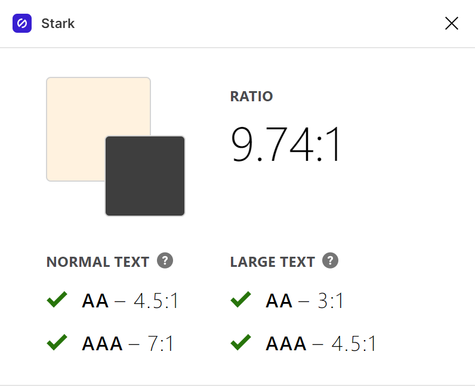
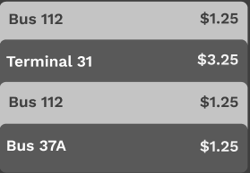
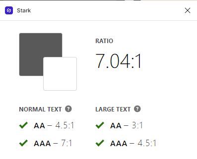
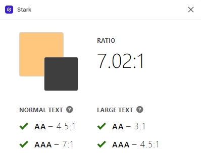

# assignment06: Interface Design 

## Summary 

The following is the initial interface design for a mobile wallet app that allows users to load their public transportation cards onto their phones. Once added, the user can readily access the card for tap payments, while also easily being able to manage the funds on their card. 

One of the major considerations while creating the user interface was accessibility, especially applicable to typography and color scheme. 

## Graphic Interface 

The interface design was modeled after Apple's wallet feature, primarily the wallet home page, as eventually I hope this feature would be integrated into existing mobile wallet applications. I wanted to keep the color scheme mostly minimal for accessibility purposes, but also because to make the focus colors stand out more, especially where they are used for buttons and icons. 

I used Figma to create the iterface, as this is a tool with which I have been getting comfortable using throughout the quarter, and there are helpful plug-ins available, such as ones to check contrast levels. 

The full user interface system can be accessed [here.](https://www.figma.com/file/ElWiKKAS014nyMBAoNTRj0/User-Interface)

## Wireflow 

The wireflows/ low-fidelity prototype off of which this user interface is based can be found [here.](https://github.com/matty-tran/DH110-2021F-MattyTran/blob/main/assignment05/README.md)

N.B. only the mobile wallet user interface is detailed below, however, the map planner from the wireframes is not. 

## Design 

The following are the user interfaces for the mobile wallet application in dark and light modes. 

### 1. Layout 

The first step that I took when I created the user interface was to create a grid layout to get a sense of the spacing of all my elements and how they would flow together on the page. Using the wireframes I had developed as a reference, I was able to choose the amount of space I wanted to include in the header and margins, and between elements so that all pages would have consistency. 

### 2. System Design 

When choosing the typography for my interface, I intially experimented with using different fonts for the header and body text. I was not able to find two fonts that I liked and felt harmonious, so I instead chose to convey the variation by making sure that the sizing was very distinct. I chose to make the body text 24pt because I thought that it looked best with the screen size I was using, and I made the header 48pt which is twice as large as the body text. Although I did not include any subtext or captions in my interface, I included it so that it could be referenced for future use. 

For color scheme, I was very tempted at the beginning to make a colorful palette to use, and intially made an interface that had orange as the primary colors. I quickly realized though that it made the interface feel very overwhelming, and made it more difficult to apply accessible design and make certain features of the interface pop to the user. Instead, I made the two primary colors I had before into the focus colors of my new color scheme, and then changing the prinary and secondary colors to a more monochromatic scheme. This had the effects of making buttons, and anything that used the focus colors pop much more to the user, and made creating the distinct light and dark modes much more seamless. 

To make the system's design consistent, I chose to use a roundness factor of 10 throughout all elements of the system. 

### 3. Accessibility 

Creating a system that was accessible visual was important to me, and something that I spent a lot of time developing. In many cases, it heavily affected the final design of the interface. In all instances of text appearing, I made sure to test the contrast with its backgroun using the Stark plug-in in Figma. As mentioned above, I encountered many cases of insufficient contrast when I had used orange as my primary color. Once I switched to a monochromatic color scheme, I was able to create sufficient contrast between the text and background. 

### 4. User Impression 

A raw video of the user's first impression can be found [here.](https://drive.google.com/file/d/17OeWd2s-ulE3Ta7c6qMhfX6eC8sdlGN0/view?usp=sharing)

The user commented that the interface looked fitting of a mobile wallet application, and that the mostly monochramatic color scheme helped to make the elements in the focus color stand out. This was reassuring to hear because it was exactly what I had intended when designing the system! 

## Conclusion 

Throughout creating the user interface I learned a lot about what entail good design. Initially, I created something that was based off of my own aesthetic preferences, but upon trying to create something that it accessible, many of these principles informed the design decisions that I made. I think that overall, in creating something that is visually accessible, I also created something that was visually appealing. 
