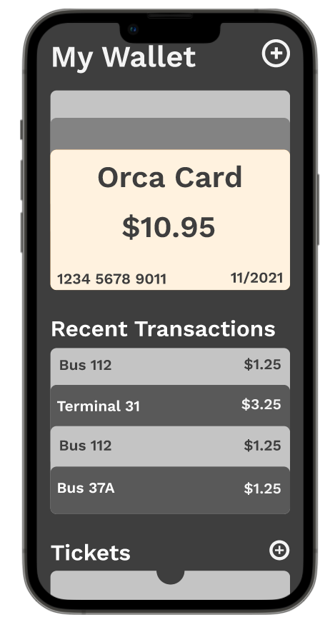
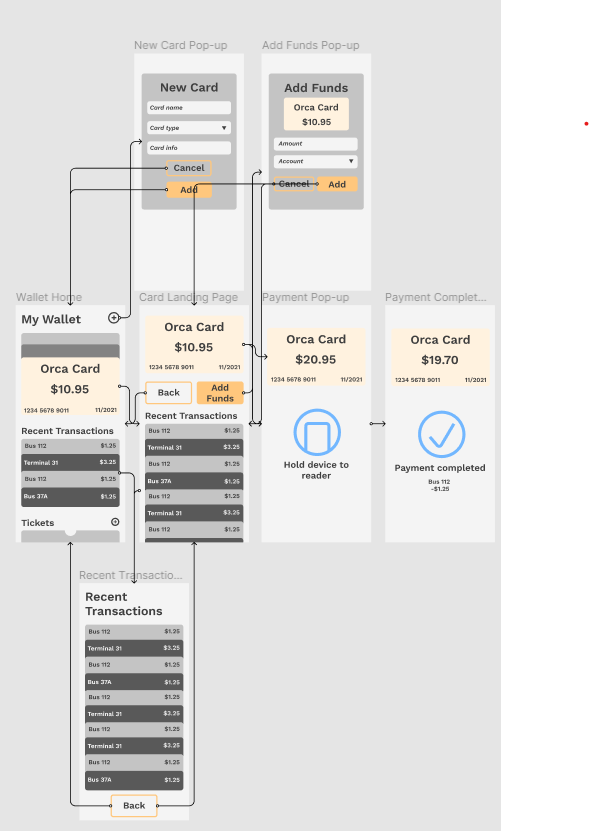
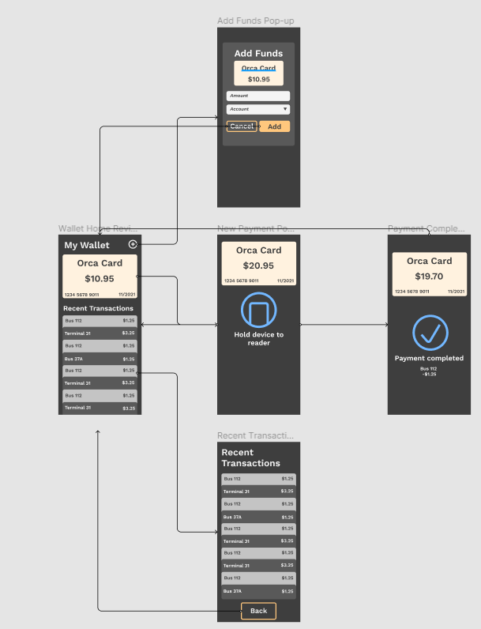

# assignment07: High Fidelity Prototype 

## About the Prototype 

The purpose of the high fidelity prototype is to closely simulate the user's experience interacting with a product, by creating a product that close to its final stage. To achieve this, I used Figma's prototyping tools to create an interactive flow of my user interface. 

The interface that was modeled is the mobile wallet application that is used by residents of King County in Washington State to pay for their public transportation. This would replace the need to carry around their Orca Card and allows them to more easily manage the funds on their cards. 

[Orca Card Wallet Prototype](https://www.figma.com/file/ElWiKKAS014nyMBAoNTRj0/User-Interface?node-id=0%3A1) 

The prototype supports the following functions: 

1. Paying for transit fare using a tap-to-pay feature 
2. Viewing recent transactions of the card
3. Adding funds to the Orca card 

## User Interface Flow 

By mapping out the flow of the user interface, we can get a better sense of the steps the user will take when interacting with our product. Additionally, this step can help direct our attention to making sure that buttons have a clear functionality and we can make sure that there are no dead-ends in our application. 

## Cognitive Walkthrough/ User Testing 

The raw audio for the user's testing can be viewed [here.](https://drive.google.com/file/d/1uwMr2bjSTlWGjyW8lnleLD6essLARSNB/view?usp=sharing)
A transcription of the interaction can be found [here.](https://docs.google.com/document/d/1V_nTJQjwsz6I-20crAb144sp7qR49-tuK40filJzKKs/edit?usp=sharing) 

When testing the high fidelity prototype, the user expressed that the application was visually appealing, using words such as "clean" and "simple." Based off the first viewing of the product, the user was able to correctly guess the functionality of the application. 

The user was asked to complete to tasks. The first task was to pay for a bus fare using the application. The user was able to complete this task, however, they expressed that they think it was not too clear how to get to the payment screen for cards, because the app functioned in a different way than other mobile apps that they have interacted with in the past. The second task was to add funds to the Orca card which the user was able to complete very easily. 

Upon further discussion with the user, they expressed that they thought that one way to make the application easier to understand was to create a separate app for the Orca card instead of trying to integrate it into an existing mobile wallet application. 

The following is a wireframe for a possible application design based off the user's input: 

## Reflection 

One part of the prototype that I struggled with was not being able to implement certain gestures that are available on mobile devices into my prototyping program. For example, on mobile devices there are physical buttons that can be pressed to interact with the application, but this was not something that I could replicate in Figma. Additionally, for the tap-to-pay feature, I would want to navigate to a payment-completed page after the user has completed their payment, however, this is also not something that I found easy to replicate in Figma. 

Based off my user's feedback, I think that I could make it so that the user can access the payment screen more easily, since that is the feature that they are most likely to want to use if they are opening this app. I would also consider making a stand-alone app instead of integrating my desired features into the existing mobile wallet applications, as this would allow me to make the application more concise instead of confusing the user with other features that do not pertain to the Orca card. 
